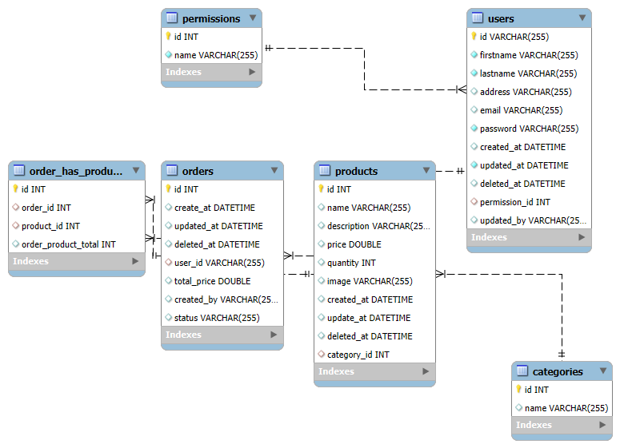

# Shopping Card API (SpringBoot)

A backend system for managing Shopping Card, built with Java and SpringBoot

## Attendance API (Fastify.Ts)

A backend system for managing attendance, built with TypeScript and Fastify.

  
  &nbsp;&nbsp;&nbsp;&nbsp;&nbsp;
  
  &nbsp;&nbsp;&nbsp;&nbsp;&nbsp;
  
  &nbsp;&nbsp;&nbsp;&nbsp;&nbsp;
  
  &nbsp;&nbsp;&nbsp;&nbsp;&nbsp;
  
  &nbsp;&nbsp;&nbsp;&nbsp;&nbsp;
  

## Technology Stack

- Language: TypeScripts
- Framework: Fastify
- Database: MySQL 
- ORM: Prisma
- Authentication: JWT
- API Communication: RESTful API
- Containerization: Docker & Docker Compose
- API Documentation: Postman , Swagger

## ER Diagram

